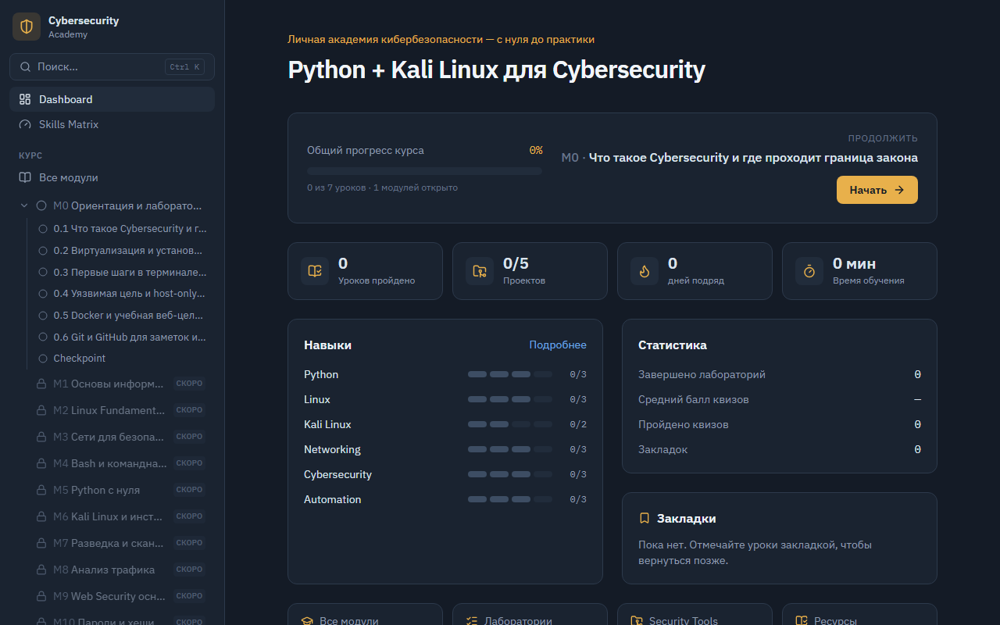

# Cybersecurity Academy

> Интерактивный самоучитель **«Python + Kali Linux для Cybersecurity»** — запускается прямо в браузере, прогресс хранится локально.

**[Открыть сайт →](https://kjvgyyi.github.io/cyber-academy/)**

[](https://github.com/kjvgyYi/cyber-academy/actions/workflows/deploy.yml)



---

## О проекте

Академия — это статический SPA без бэкенда. Весь учебный контент (уроки, квизы, задачи, справочники) живёт в папке `content/` в виде Markdown и YAML-файлов. Приложение подхватывает их через `import.meta.glob` и рендерит — добавить урок значит положить один `.md`-файл.

**Сейчас доступен Модуль 0** — ориентация и сборка лаборатории (7 уроков + Checkpoint). Ещё 17 модулей есть в структуре и открываются по мере добавления контента.

### Что есть в приложении

- Дерево курса с прогрессом по каждому уроку
- Интерактивные задачи с подсказками и разбором решений
- Квизы с объяснениями ответов
- Матрица навыков, лаборатории, проекты, security-challenges
- Справочник команд и инструментов
- Глобальный поиск (`Ctrl+K`)
- Тёмная тема, адаптивный layout, полная работа на мобильных

---

## Быстрый старт

```bash
npm install
npm run dev       # http://localhost:5173
```

## Все команды

| Команда | Что делает |
|---|---|
| `npm run dev` | Dev-сервер с горячей перезагрузкой |
| `npm run build` | Production-сборка в `dist/` |
| `npm run build:single` | Одна самодостаточная HTML-страница в `dist-single/` |
| `npm run preview` | Просмотр собранной версии |
| `npm run typecheck` | Проверка типов без сборки |
| `npm run test` | Vitest-тесты |
| `npm run test:e2e` | Playwright e2e (мобильный Pixel 7, требует `npm run preview`) |
| `npm run check` | Полная проверка: типы + тесты + сборка |

**Требования:** Node.js 20+ (проверено на Node 22).

---

## Структура

```
cyber-academy/
├─ content/                  # весь учебный контент — меняется чаще всего
│  ├─ course.yaml            # фазы + список 18 модулей
│  ├─ skills.yaml / projects.yaml / labs.yaml / challenges.yaml
│  ├─ commands.yaml / tools.yaml / resources.yaml
│  ├─ quizzes/               # quiz-*.yaml
│  └─ modules/
│     └─ 00-orientation/
│        ├─ module.md
│        └─ lesson-0-1.md … lesson-0-7-checkpoint.md
├─ src/
│  ├─ content/               # движок: типы, парсер, glob-загрузчик
│  ├─ lib/                   # прогресс (localStorage), селекторы, поиск
│  ├─ components/            # UI, Markdown-рендер, карточки задач/квизов
│  ├─ pages/                 # Dashboard, Lesson, Skills, Projects, …
│  ├─ styles/index.css       # Tailwind v4, тёмная тема
│  ├─ App.tsx                # маршруты (HashRouter)
│  └─ main.tsx
├─ e2e/                      # Playwright mobile-тесты (Pixel 7 390px)
├─ vite.config.ts
└─ package.json
```

---

## Как добавлять контент

### Новый урок

Создай файл в папке модуля:

```markdown
---
id: "0.2"
module: 0
order: 2
kind: lesson          # lesson | lab | checkpoint
title: Название урока
estimatedTime: 45
difficulty: beginner  # beginner | intermediate | advanced
skills: [linux]
prerequisites: ["0.1"]
tags: [терминал]
quizIds: [quiz-0-2]   # необязательно
---

Обычный Markdown. Урок появится в дереве автоматически.
```

### Специальные блоки в уроке

**Терминал** — кнопка Copy, строки с `$ ` подсвечены как команды:

    ```terminal
    $ pwd
    /home/kali
    ```

**Callout** (`info` / `warning` / `safety` / `tip`):

    ```safety Правило безопасности
    Только своя VM и localhost.
    ```

**Задача** — интерактивная карточка с подсказками и разбором:

    ```task
    id: task-0-2-example
    title: Название
    input: true
    answers: ["pwd"]
    prompt: |
      Текст задания (Markdown).
    hints:
      - Первая подсказка
    solution: |
      Разбор решения.
    ```

**Квиз** — вставляется по id:

    ```quiz
    quiz-0-2
    ```

### Новый квиз

```yaml
# content/quizzes/quiz-0-2.yaml
id: quiz-0-2
title: Проверка — тема
lesson: "0.2"
module: 0
questions:
  - q: Текст вопроса?
    options:
      - Вариант A
      - "Вариант B: с двоеточием — берём в кавычки"
    answer: 1
    explanation: Почему верен вариант B.
```

> **YAML и двоеточие:** если значение содержит `: ` — обязательно бери в кавычки, иначе парсер создаст вложенный ключ вместо строки.

### Новый модуль

1. Добавь запись в `content/course.yaml`.
2. Создай `content/modules/NN-slug/module.md` и уроки в той же папке.
3. Модуль становится «доступным» автоматически, как только в нём есть хотя бы один урок.

---

## Деплой

Пуш в `main` → GitHub Actions собирает и публикует на GitHub Pages автоматически.

Для ручного деплоя на любой статический хостинг:

```bash
npm run build
# загрузи dist/ на хостинг
```

HashRouter + `base: './'` — серверные rewrite-правила не нужны.

---

## Стек

React 19 · TypeScript (strict) · Vite 8 · Tailwind CSS v4 · React Router v7 · react-markdown · Vitest · Playwright
